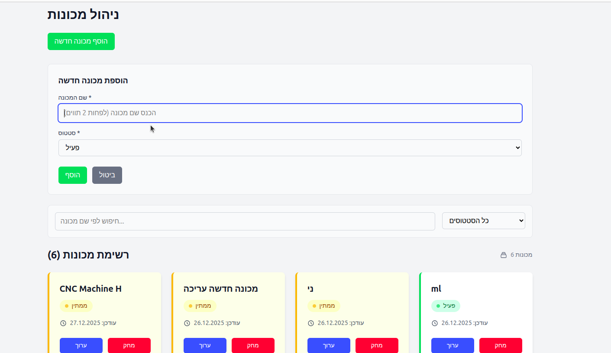
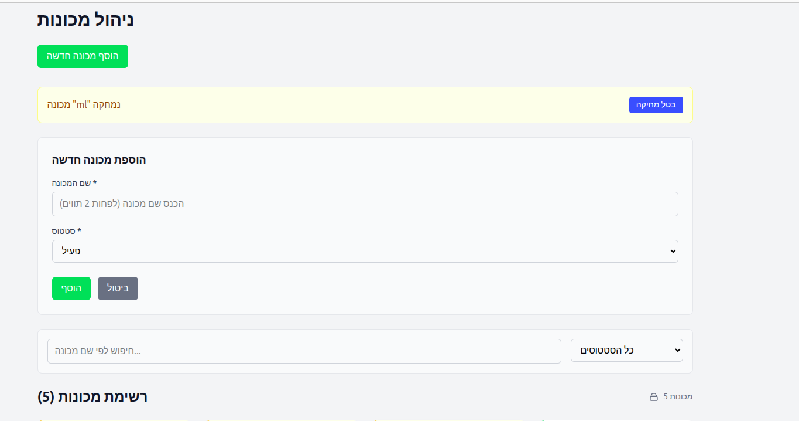
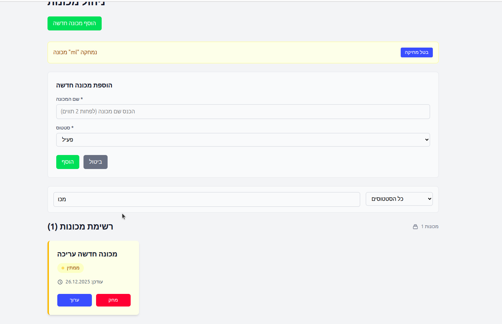
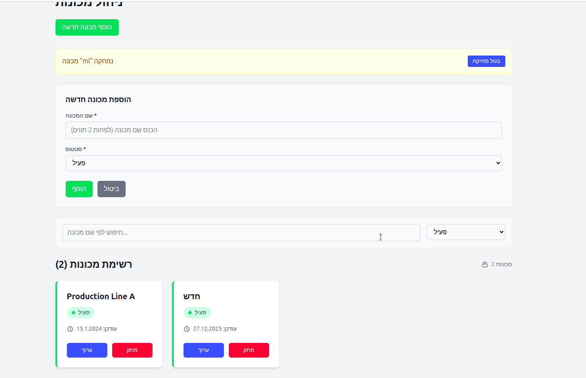

# 🏭 Machine Status Dashboard

[](https://reactjs.org/)
[](https://www.typescriptlang.org/)
[](https://tailwindcss.com/)
[](https://kubernetes.io/)
[](https://www.docker.com/)

> Modern React + TypeScript dashboard for factory machine status monitoring with Kubernetes deployment.

## ✨ Features

- **Machine Management**: CRUD operations with undo functionality
- **Status Monitoring**: Real-time status tracking (Running, Idle, Offline)
- **Search & Filter**: Live filtering by name and status
- **Data Persistence**: localStorage with seed data
- **Responsive Design**: Mobile-first with Tailwind CSS
- **Type Safety**: Full TypeScript implementation
- **Cloud Ready**: Docker + Kubernetes deployment

## 📸 Screenshots

### Main Dashboard

*Main dashboard showing machine cards with status indicators*

### Add/Edit Machine Form

*Form for adding or editing machine details*

### Filter and Search

*Live filtering by status and search functionality*

### Undo Functionality

*Undo notification after machine deletion*

## 🚀 Quick Start

### Prerequisites
- Node.js 18+
- npm 8+

### Development
```bash
# Clone and install
git clone https://github.com/sarada26-hub/machine-status-dashboard.git
cd machine-status-dashboard
npm install

# Start dev server 
npm run dev
# ➜ http://localhost:5173
```

### Production Build
```bash
npm run build
npm run preview
```

## ☁️ Deployment

### Docker
```bash
docker build -t machine-dashboard .
docker run -p 8080:80 machine-dashboard
```

### Kubernetes
```bash
# Basic deployment
kubectl apply -f k8s/base/

# Production with Kustomize
kubectl apply -k k8s/overlays/production/
```

**Access URLs:**
- Base: `http://<node-ip>:30081`
- Production: `http://<node-ip>:30081`

## Kubernetes Deployment

### Prerequisites
- Kubernetes cluster
- kubectl configured

### Deploy to Kubernetes

#### Basic Deployment
```bash
# Apply all manifests
kubectl apply -f k8s/base/

# Check deployment status
kubectl get pods -l app=machine-dashboard
kubectl get services
```

#### Using Kustomize (Recommended)
```bash
# Deploy base configuration
kubectl apply -k k8s/base/

# Deploy production overlay
kubectl apply -k k8s/overlays/production/
```

### Access the Application
- **Base**: http://\<node-ip\>:30081
- **Production**: http://\<node-ip\>:30081
- **Local cluster**: Use port forwarding for local access

### Environment Variables
The app uses `VITE_APP_TITLE` environment variable for the page title, configured via ConfigMap.

## 🏗️ Architecture

### Tech Stack
- **Frontend**: React 19 + TypeScript + Tailwind CSS
- **Build**: Vite
- **State**: Context API + useReducer
- **Storage**: localStorage
- **Container**: Docker + nginx
- **Orchestration**: Kubernetes

### Project Structure
```
src/
├── components/          # UI components
│   ├── Header/
│   ├── MachineList/
│   ├── MachineForm/
│   ├── FilterSearch/
│   └── UndoNotification/
├── pages/              # Page 
   └── MachinesDashboard/
├── context/            # State management
├── hooks/              # Custom hooks
├── types/              # TypeScript types
├── utils/              # Helper functions
├── services/           # Data services
├── data/               # Seed data
└── constants/          # Application constants
```

### Key Design Patterns
- **Context + Reducer**: Centralized state management
- **Custom Hooks**: Reusable logic extraction
- **Service Layer**: Data persistence abstraction
- **Type Safety**: Strict TypeScript throughout

## 📊 Assumptions and Shortcuts Taken

- **No Backend**: Using localStorage for data persistence instead of a real API
- **Simple Validation**: Basic client-side validation only (name length, required fields)
- **No Authentication**: No user management or access control implemented
- **Basic Error Handling**: Minimal error states and user feedback
- **Simple Kubernetes Setup**: Basic manifests without advanced features like health checks, resource limits, or ingress
- **No Real-time Updates**: Data updates only when user interacts with the app
- **Seed Data**: Hardcoded sample machines for initial app state

## 📊 Current Limitations

- No backend API (localStorage only)
- Basic form validation
- No user authentication
- Simple Kubernetes setup
- No real-time updates

## 🚀 Future Enhancements

- REST API integration
- WebSocket for real-time updates
- Advanced filtering & search
- User authentication
- Monitoring & alerting
- Unit & integration tests
